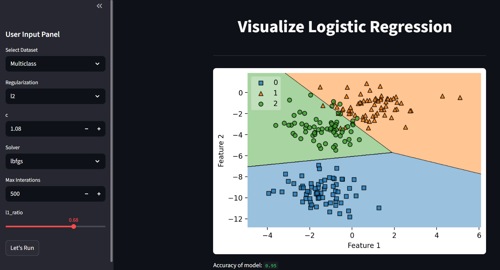

# Decision Region Visualizer

- An **interactive app** to visualize  decision regions for **binary and multiclass datasets**.  
- Adjust hyperparameters in real-time and see the decision boundary update dynamically.

---

## Features

- Visualize **binary and multiclass datasets**  
- Choose **regularization type**: `none`, `l1`, `l2`, `elasticnet`  
- Adjust **hyperparameters**: `C`, `max_iter`, `solver`, `l1_ratio`  
- Interactive **sidebar for parameter inputs**  
- Displays **accuracy** after training the model  

---

## Demo

  

---

## Installation

1. **Clone the repository**
```bash
git clone https://github.com/<your-username>/Logistic-Regression-Visualizer.git
cd Logistic-Regression-Visualizer
```

2. **Create a virtual environment**
```bash
# windows
python -m venv venv
venv\Scripts\activate

# macOS / Linux
python3 -m venv venv
source venv/bin/activate
```

3. **Install dependencies**
```bash
pip install -r requirements.txt
```

4. **Run the Streamlit app**
```bash
streamlit run app.py
```

---

[Try the app live!](https://decision-regions-visualizer-by-geek.streamlit.app/)
